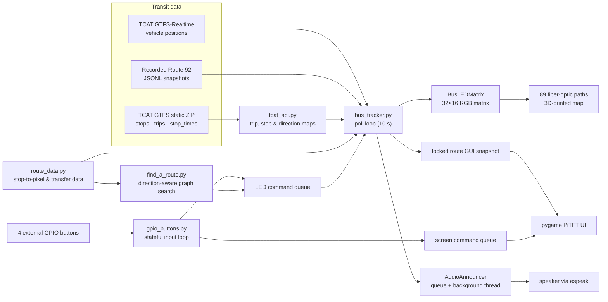

# Big Red Routes

> A Raspberry Pi–based, physical TCAT transit display that turns live bus data into an interactive, 3D-printed map of selected Cornell and Ithaca routes.

**Big Red Routes** is an embedded Linux project built by Selena Zhang and Helen Ni for Cornell ECE 5725, *Design with Embedded Operating Systems*. A Raspberry Pi 4 polls TCAT transit feeds, maps vehicle stop IDs to a 32×16 RGB LED matrix, and sends the light through 89 fiber-optic paths in a 12 × 21 inch printed map. A PiTFT and four external GPIO buttons provide route tracking and trip-planning controls; a speaker announces bus arrivals for the route being viewed.

The project focuses on TCAT routes **30, 81, and 92**. It is a complete hardware/software integration project rather than a web-only visualization.

## What it demonstrates

- Embedded Linux application design on a Raspberry Pi 4, with PiTFT, GPIO, RGB matrix, and audio peripherals operating together.
- Ingestion of TCAT GTFS static data and GTFS-Realtime vehicle positions; static trips, stops, and stop times are joined with live vehicle records.
- A hand-authored `(route_id, stop_id) → (x, y)` coordinate model that connects transit data to physical LED pixels and fiber-optic endpoints.
- Concurrent control loops: TCAT polling, GPIO input, PiTFT rendering, and queued speech run without putting UI handling behind network or audio work.
- Shared-state protection with `threading.Lock` and explicit inter-thread command queues for the display and LED controller.
- A direction-aware graph search that scores candidate trips by transfers first, then ride steps and path length.
- Hardware debugging and iteration across a 3D-printed enclosure/map, fiber-optic routing, an RGB matrix, external buttons, and display integration.

## System architecture

## Hardware and physical design

| Component | Role in the system |
| --- | --- |
| Raspberry Pi 4 | Runs the embedded Linux application and interfaces with the display, matrix, buttons, and speaker. |
| 16×32 Adafruit RGB LED matrix | Produces the per-stop light source; it replaces a large number of individually wired LEDs. |
| 89 × 1 mm fiber-optic cables | Carry matrix light to the physical stop locations on the map. |
| 3D-printed 12 × 21 in map | A hand-traced Figma vector map exported to SVG, extruded in Fusion, and printed in six puzzle-like pieces. |
| 3D-printed fiber holder | A 5 mm tall, 1 mm-hole board that aligns fiber runs over matrix pixels. |
| PiTFT 2.8 in display | Shows the Pygame menu, selected route, and bus information. |
| Four external buttons | Provide reliable physical navigation on GPIO 18, 14, 19, and 15; external buttons were used because the matrix consumes pins normally used by the Pi’s built-in buttons. |
| Speaker | Plays queued arrival announcements. |

Eight printed pillars elevate the map and provide space for the matrix, fiber runs, and wiring. On the map, green indicates outbound travel (north to south) and red indicates inbound travel (south to north).

## Software design

### Data acquisition and normalization

At startup, `tcat_api.load_gtfs_static_data()` downloads TCAT’s static GTFS ZIP and parses `stops.txt`, `trips.txt`, and `stop_times.txt`. It builds trip-direction metadata and identifies stops for the three targeted routes. The polling loop then calls `fetch_vehicle_feed()` against the GTFS-Realtime vehicle endpoint. Each record carries the vehicle ID, trip ID, route ID, stop ID, current status, occupancy, and timestamp.

Direction names vary between routes, so `normalize_direction()` applies route-specific and general rules to classify a bus as inbound, outbound, or unknown. `build_bus_snapshot()` only emits buses whose `(route_id, stop_id)` pair has a physical pixel assignment.

The configured poll interval is **10 seconds** (`POLL_SECONDS`). Route 92 has a practical availability constraint: when it is selected but absent from the live feed, the application replays valid snapshots from `route92_recorded_data.jsonl`. The checked-in recording contains 650 valid one-bus snapshots for Route 92.

### Physical display model

`route_data.py` is the contract between transit data and the physical artifact. It contains per-route stop dictionaries, directional ordered stop lists, picker orders, and permitted transfer points. `build_global_stop_maps()` derives:

- stop names keyed by `(route_id, stop_id)`;
- matrix coordinates keyed by `(route_id, stop_id)`.

`BusLEDMatrix` wraps the `rgbmatrix` library with the Adafruit HAT mapping, 11-bit PWM, a configurable brightness/slowdown, and a lock-protected `active_pixels` map. It redraws the frame canvas through `SwapOnVSync`, which keeps matrix operations in one component even when the rest of the program is receiving input or network updates.

### Concurrency and interface boundaries

The application keeps slow or independent activities out of the user-input path:

- `bus_poll_loop()` receives LED commands, polls transit data, updates a lock-protected GUI snapshot, and redraws the matrix.
- `gpio_button_loop()` owns menu state and publishes commands to separate screen and LED queues.
- `pitft_screen_loop()` consumes screen commands and periodically renders the Pygame display from a copied route snapshot.
- `AudioAnnouncer` owns a message queue and daemon thread; it invokes `espeak` one announcement at a time instead of blocking the polling/UI flow.

Trip-planning mode disables and clears pending audio, highlights the current stop selection, locks selected endpoints, and then lights the chosen route segments.

### Route planning

`find_a_route.py` models each directional stop as a `StopNode`. Sequential stops on the same route become **ride** edges; only entries listed in `TRANSFER_STOP_LOOKUP` become cross-route **transfer** edges. Recursive backtracking evaluates valid paths with this lexicographic score:

1. fewest transfers;
2. fewest ride steps;
3. fewest total nodes.

The resulting route segments include the pixels needed to illuminate the physical path. Separating inbound and outbound stop lists prevents a user from selecting a path that goes backward relative to the chosen travel direction.

## Engineering decisions and debugging record

| Decision or issue | Response documented in this repository |
| --- | --- |
| Lighting dozens of stops | Used a 16×32 matrix plus fiber optics rather than wiring an individual LED at each stop. |
| Matrix conflicts with button pins | Added four external, color-capped GPIO buttons on free pins. |
| Touchscreen responsiveness | Used physical buttons as the primary interaction method after the touchscreen proved unreliable. |
| Fiber alignment and light transfer | Printed test pieces with different hole sizes and compared Figma’s pixel-based design sizing with Fusion’s millimeter-based sizing. |
| Blinking/flashing matrix | Tested wiring and GPIO with independent test code, isolated the problem to the panel rather than application code, and replaced the matrix. |
| Route 92 gaps in live data | Added recorded-data replay that is converted into the same record shape as live data. |
| Direction and transfer correctness | Created directional stop data and transfer dictionaries, then exercised many start/end combinations to correct missing inbound/outbound stops and prevent reverse paths. |
| Integrated startup | Tested launch on power-up through a `.bashrc` invocation and Raspberry Pi Console Autologin configuration. |

## Repository map

| Path | Responsibility |
| --- | --- |
| `main.py` | Initializes hardware, shared queues, and the polling/GPIO threads; runs the PiTFT loop. |
| `config.py` | TCAT endpoints, target routes, polling interval, display size, and color constants. |
| `tcat_api.py` | Static GTFS parsing, GTFS-Realtime parsing, direction normalization, and display snapshots. |
| `bus_tracker.py` | Polling/replay orchestration, GUI-state publication, LED drawing, and audio events. |
| `route_data.py` | Stop metadata, matrix coordinates, directional route order, and transfers. |
| `find_a_route.py` | Direction-aware graph construction and route search. |
| `gpio_buttons.py` | GPIO setup and stateful physical-button navigation. |
| `gui.py` | Pygame UI rendering for the PiTFT. |
| `led_matrix.py` | Thread-safe RGB matrix adapter. |
| `audio_announcer.py` | Queued `espeak` announcement worker. |
| `pigame.py` | PiTFT touchscreen/Pygame adapter. |
| `route92_recorded_data.jsonl` | Route 92 fallback snapshots. |
| `docs/` | Project site, demo, wiring documentation, photos, references, and team context. |

## Dependencies and target environment

The code imports Python modules and tools appropriate to the hardware target:

- Python with `requests` and `google.transit.gtfs_realtime_pb2`
- `RPi.GPIO`
- `rgbmatrix` / `RGBMatrixOptions`
- `pygame` and `pitft_touchscreen`
- `espeak` available on the target for spoken announcements
- Raspberry Pi OS (the project documentation records kernel `6.1.21-v8+ #1642 SMP PREEMPT`)

The repository does not include a dependency lockfile or a hardware-free simulation target. Running `main.py` assumes the Raspberry Pi peripherals and their supporting libraries are installed and connected.

## Demo and project site

- [Watch the project demonstration](https://www.youtube.com/embed/oHyLYknp8As)
- [Read the project portfolio site](docs/index.html)

## Team

**Selena Zhang** and **Helen Ni** collaborated on the design, hardware, software, testing, and integration. Selena traced the map vectors and prepared the SVG; Helen imported the design into Fusion, extruded it, and prepared the parts for 3D printing. The team jointly wired and assembled the electronics, connected TCAT data to the displays, implemented the interface and routing features, and debugged touchscreen, Route 92, route-data, and integration issues.

## References

- [TCAT myStop](https://realtimetcatbus.availtec.com/InfoPoint/)
- [TCAT real-time data endpoint](https://realtimetcatbus.availtec.com/InfoPoint/Minimal)
- [Adafruit 16×32 matrix and Raspberry Pi guide](https://cdn-learn.adafruit.com/downloads/pdf/connecting-a-16x32-rgb-led-matrix-panel-to-a-raspberry-pi.pdf)
- [Manhattan Subway Map project that inspired the initial concept](https://hackaday.io/project/202488-manhattan-subway-map/details)
